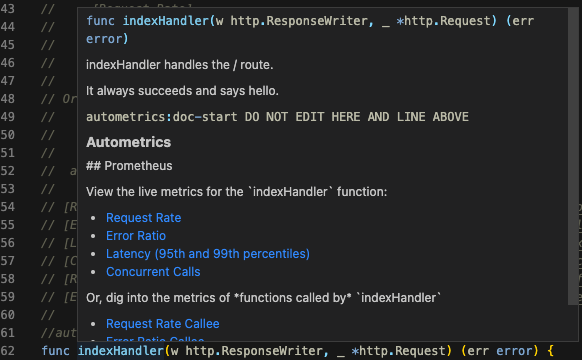
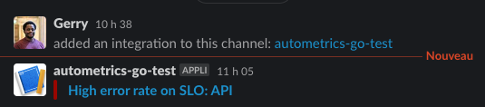

[](https://pkg.go.dev/github.com/autometrics-dev/autometrics-go)
[](https://discord.gg/kHtwcH8As9)

Metrics are a powerful and cost-efficient tool for understanding the health and
performance of your code in production, but it's hard to decide what metrics to
track and even harder to write queries to understand the data.

Autometrics is a [Go
Generator](https://pkg.go.dev/cmd/go#hdr-Generate_Go_files_by_processing_source)
bundled with a library that instruments your functions with the most useful
metrics: request rate, error rate, and latency. It standardizes these metrics
and then generates powerful Prometheus queries based on your function details to
help you quickly identify and debug issues in production.

## Benefits

- ✨ `//autometrics:inst` directive adds useful metrics to any function, without you thinking about what metrics to collect
- 💡 Generates powerful Prometheus queries to help quickly identify and debug issues in production
- 🔗 Injects links to live Prometheus charts directly into each function's doc comments
- [📊 Grafana dashboards](https://github.com/autometrics-dev/autometrics-shared#dashboards) work without configuration to visualize the performance of functions & [SLOs](https://docs.rs/autometrics/latest/autometrics/objectives/index.html)
- 🔍 Correlates your code's version with metrics to help [identify commits](https://fiberplane.com/blog/autometrics-rs-0-4-spot-commits-that-introduce-errors-or-slow-down-your-application) that introduced errors or latency
- 📏 Standardizes metrics across services and teams to improve debugging
- ⚖️ Function-level metrics provide useful granularity without exploding cardinality

## Advanced Features

- [🚨 Define alerts](#generate-alerts-automatically) using SLO best practices directly in your source code
- [📍 Attach exemplars](#exemplar-support) automatically to connect metrics with traces
- [⚙️ Configurable](#opentelemetry-support) metric collection library
  ([`opentelemetry`](https://pkg.go.dev/go.opentelemetry.io/otel) or
  [`prometheus`](https://pkg.go.dev/github.com/prometheus/client_golang))

See [autometrics.dev](https://docs.autometrics.dev/) for more details on the ideas behind autometrics.

## Example



When alerting rules are added, code annotations make Prometheus trigger alerts
directly from production usage:



A fully working use-case and example of library usage is available in the
[examples/web](./examples/web) subdirectory. You can build and run load on the
example server using:

```console
git submodule update --init
docker compose -f docker-compose.prometheus-example.yaml up
```

And then explore the generated links by opening the [main
file](./examples/web/cmd/main.go) in your editor.

# Quickstart

There is a one-time setup phase to prime the code for autometrics. Once this
phase is accomplished, only calling `go generate` is necessary.

### 1. Install the go generator.

The generator is the binary in cmd/autometrics, so the easiest way to get it is
to install it through go:

```console
go install github.com/autometrics-dev/autometrics-go/cmd/autometrics@latest
```

<details>
<summary> Make sure your `$PATH` is set up</summary>
In order to have `autometrics` visible then, make sure that the directory
`$GOBIN` (or the default `$GOPATH/bin`) is in your `$PATH`:

``` console
$ echo "$PATH" | grep -q "${GOBIN:-$GOPATH/bin}" && echo "GOBIN in PATH" || echo "GOBIN not in PATH, please add it"
GOBIN in PATH
```
</details>

### 2. Import the libraries and initialize the metrics

In the main entrypoint of your program, you need to both add package

``` go
import (
	"github.com/autometrics-dev/autometrics-go/prometheus/autometrics"
)
```

And then in your main function initialize the metrics

``` go
	autometrics.Init(
		nil,
		autometrics.DefBuckets,
		autometrics.BuildInfo{Version: "0.4.0", Commit: "anySHA", Branch: "", Service: "myApp"},
	)
```

Everything in `BuildInfo` is optional. It will add relevant information on the
metrics for better intelligence. You can use any string variable whose value is
injected at build time by `ldflags` for example, or use environment variables.

> **Note**
> Instead of hardcoding the service in the code, you can simply have environment variables set to fill the "Service" name.
`AUTOMETRICS_SERVICE_NAME` will be used if set, otherwise `OTEL_SERVICE_NAME` will be attempted (so OpenTelemetry
compatibility comes out of the box).

### 3. Add directives for each function you want to instrument

> **Warning**
> You must both add the `//go:generate` directive, and one `//autometrics:inst`
directive per function you want to instrument

On top of each file you want to use Autometrics in, you need to have a `go generate` cookie:

``` go
//go:generate autometrics
```

Then instrumenting functions depend on their signature, expand the corresponding
subsection to see details:
- if the function [returns an `error`](#for-error-returning-functions), or
- if the function [is a `http.Handler`](#for-http-handler-functions).

Once it is done, you can call the [generator](#4-generate-the-documentation-and-instrumentation-code)

#### For error-returning functions

<details><summary><i>Expand to instrument error returning functions</i></summary>

Given a starting function like:

```go
func AddUser(args any) error {
        // Do stuff
        return nil
}
```

The manual changes you need to do are:

```patch
+//autometrics:inst
-func AddUser(args any) error {
+func AddUser(args any) (err error) {
        // Do stuff
        return nil
}
```

The generated metrics will count a function as having failed if the `err` return value is non-nil.

> **Warning**
> If you want the generated metrics to contain the function success rate, you
_must_ name the error return value. This is why we recommend to name the error
value you return for the function you want to instrument.
</details>

#### For HTTP handler functions

<details><summary><i>Expand to instrument HTTP handlers functions</i></summary>

Autometrics comes with a middleware library for `net.http` handler functions.

- Import the middleware library

``` go
import "github.com/autometrics-dev/autometrics-go/prometheus/midhttp"
```

- Wrap your handlers in `Autometrics` handler

``` patch

	http.Handle(
		"/path", 
+		midhttp.Autometrics(
-		http.HandlerFunc(routeHandler),
+			http.HandlerFunc(routeHandler),
+			// Optional: override what is considered a success (default is 100-399)
+			autometrics.WithValidHttpCodes([]autometrics.ValidHttpRange{{Min: 200, Max: 299}}),
+			// Optional: Alerting rules
+			autometrics.WithSloName("API"),
+			autometrics.WithAlertSuccess(90),
+		)
	)
```

The generated metrics here will count a function as having failed if the return
code of the handler is bad (in the `4xx` and `5xx` ranges). The code snippet
above shows how to override the ranges of codes that should be considered as
errors for the metrics/monitoring.

> **Note**
> There is only middleware for `net/http` handlers for now, but support for other web frameworks will
come as needed/requested! Don't hesitate to create issues in the repository.

> **Warning**
> To properly report the function name in the metrics, the autometrics wrapper should be the innermost
middleware in the stack.
</details>

### 4. Generate the documentation and instrumentation code

You can now call `go generate`:

```console
$ go generate ./...
```

The generator will augment your doc comment to add quick links to metrics (using
the Prometheus URL as base URL), and add a unique defer statement that will take
care of instrumenting your code.

`autometrics --help` will show you all the different arguments that can control
behaviour through environment variables. The most important options are
[changing the
target](#make-generated-links-point-to-different-prometheus-instances) of
generated links, or [disabling doc generation](#remove-the-documentation) to
keep only instrumentation

### 5. Expose metrics outside

The last step now is to actually expose the generated metrics to the Prometheus instance.

The shortest way is to reuse `prometheus/promhttp` handler in your main entrypoint:

``` go
import (
	"github.com/autometrics-dev/autometrics-go/prometheus/autometrics"
	"github.com/prometheus/client_golang/prometheus/promhttp"
)


func main() {
	autometrics.Init(
		nil,
		autometrics.DefBuckets,
		autometrics.BuildInfo{Version: "0.4.0", Commit: "anySHA", Branch: "", Service: "myApp"},
	)
	http.Handle("/metrics", promhttp.Handler())
}
```

This is the shortest way to initialize and expose the metrics that autometrics will use
in the generated code.

A Prometheus server can be configured to poll the application, and the autometrics will be available! (See the [Web App example](./examples/web) for a simple, complete setup)

### Run Prometheus locally to validate and preview the data

You can use the open source Autometrics CLI to run automatically configured Prometheus locally to see the metrics that will be registered by the change. See the [Autometrics CLI docs](https://docs.autometrics.dev/local-development#getting-started-with-am) for more information.

or you can configure Prometheus manually:

```yaml
scrape_configs:
  - job_name: my-app
    metrics_path: /metrics # the endpoint you configured your metrics exporter on (usually /metrics)
    static_configs:
      - targets: ['localhost:<PORT>'] # The port your service is on
    scrape_interval: 200ms
    # For a real deployment, you would want the scrape interval to be
    # longer but for testing, you want the data to show up quickly
```

You can also check the documentation to find out about setting up Prometheus
[locally](https://docs.autometrics.dev/configuring-prometheus/local), with
[Fly.io](https://docs.autometrics.dev/configuring-prometheus/fly-io), or with
[Kubernetes](https://docs.autometrics.dev/configuring-prometheus/kubernetes)

---

# Optional advanced features

#### Generate alerts automatically

Change the annotation of the function to automatically generate alerts for it:

``` go
//autometrics:inst --slo "Api" --success-target 90
func AddUser(args any) (err error) {
        // Do stuff
        return nil
}
```

Then **you need to add** the [bundled](./configs/shared/autometrics.rules.yml)
recording rules to your prometheus configuration.

The valid arguments for alert generation are:
- `--slo` (*MANDATORY* for alert generation): name of the service for which the objective is relevant
- `--success-rate` : target success rate of the function, between 0 and 100 (you
  must name the `error` return value of the function for detection to work.)
- `--latency-ms` : maximum latency allowed for the function, in milliseconds.
- `--latency-target` : latency target for the threshold, between 0 and 100 (so X%
  of calls must last less than `latency-ms` milliseconds). You must specify both
  latency options, or none.
  
> **Warning**
> The generator will error out if you use percentile targets that are not
supported by the bundled [Alerting rules file](./configs/shared/autometrics.rules.yml).
Support for custom target is planned but not present at the moment


> **Warning** 
> You **MUST** have the `--latency-ms` values to match the values
 given in the buckets given in the `autometrics.Init` call. The values in the
 buckets are given in _seconds_. By default, the generator will error and tell
 you the valid default values if they don't match. If the default values in
 `autometrics.DefBuckets` do not match your use case, you can change the
 buckets in the init call, and add a `--custom-latency` argument to the
 `//go:generate` invocation.
```patch
-//go:generate autometrics
+//go:generate autometrics --custom-latency
```

#### Exemplar support

When using the Prometheus library for metrics collection, it automatically adds
trace and span information in the metrics as exemplars that can be queried with
Prometheus, [if the server is configured
correctly](https://prometheus.io/docs/prometheus/latest/feature_flags/#exemplars-storage)


  
#### OpenTelemetry Support

Autometrics supports using OpenTelemetry with a prometheus exporter instead of using
Prometheus to publish the metrics. The changes you need to make are:

- change where the `autometrics` import points to
```patch
import (
-	"github.com/autometrics-dev/autometrics-go/prometheus/autometrics"
+	"github.com/autometrics-dev/autometrics-go/otel/autometrics"
)
```
- change the call to `autometrics.Init` to the new signature: instead of a registry,
the `Init` function takes a meter name for the `otel_scope` label of the exported
metric. You can use the name of the application or its version for example

``` patch
	autometrics.Init(
-		nil,
+		"myApp/v2/prod",
		autometrics.DefBuckets,
		autometrics.BuildInfo{ Version: "2.1.37", Commit: "anySHA", Branch: "", Service: "myApp" },
	)
```

- add the `--otel` flag to the `//go:generate` directive

```patch
-//go:generate autometrics
+//go:generate autometrics --otel
```

#### Git hook

As autometrics is a Go generator that modifies the source code when run, it
might be interesting to set up `go generate ./...` to run in a git pre-commit
hook so that you never forget to run it if you change the source code.

If you use a tool like [pre-commit](https://pre-commit.com/), see their
documentation about how to add a hook that will run `go generate ./...`.

Otherwise, a simple example has been added in the [configs folder](./configs/pre-commit)
as an example. You can copy this file in your copy of your project's repository, within
`.git/hooks` and make sure that the file is executable.

## Tips and Tricks

##### Make generated links point to different Prometheus instances
By default, the generated links will point to `localhost:9090`, which the default location
of Prometheus when run locally.

The environment variable `AM_PROMETHEUS_URL` controls the base URL of the instance that
is scraping the deployed version of your code. Having an environment variable means you
can change the generated links without touching your code. The default value, if absent,
is `http://localhost:9090/`.

You can have any value here, the only adverse impact it can
have is that the links in the doc comment might lead nowhere useful.

##### Remove the documentation
By default, autometrics will add a lot of documentation on each instrumented
function. If you prefer not having the extra comments, but keep the
instrumentation only, you have multiple options:

- To disable documentation **on a single function**, add the `--no-doc` argument to the `//autometrics:inst` directive:
``` patch
-//autometrics:inst
+//autometrics:inst --no-doc
```
- To disable documentation **on a file**, add the `--no-doc` argument to the `//go:generate` directive:
``` patch
-//go:generate autometrics
+//go:generate autometrics --no-doc
```
- To disable documentation **globally**, use the environment variable `AM_NO_DOCGEN`:
``` console
$ AM_NO_DOCGEN=true go generate ./...
```


# Contributing

The first version of the library has _not_ been written by Go experts. Any comment or
code suggestion as Pull Request is more than welcome!

Issues, feature suggestions, and pull requests are very welcome!

If you are interested in getting involved:
- Join the conversation on [Discord](https://discord.gg/9eqGEs56UB)
- Ask questions and share ideas in the [Github Discussions](https://github.com/orgs/autometrics-dev/discussions)
- Take a look at the overall [Autometrics Project Roadmap](https://github.com/orgs/autometrics-dev/projects/1)
