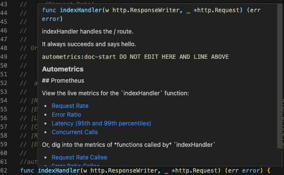
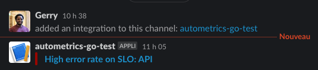
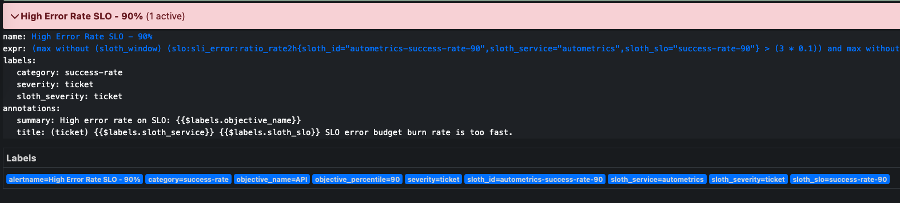
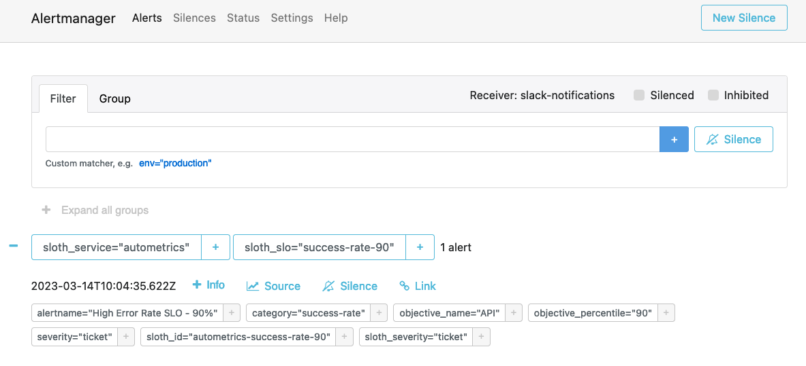

# Web application instrumented in seconds

This is an example application to show how fast you can setup autometrics.

It shows the generator usage and sets up Prometheus to showcase the
"automatically generated links" feature.

## Quick start

``` sh
GOOS=linux GOARCH=amd64 go build -o web-server ./cmd/main.go
docker compose up -d
./poll_server
```

Then open [main](./cmd/main.go) in your editor and interact with the documentation links!



### Alert generation

Optionnally, create a slack integration with an "incoming webhook" for one of
your channels, and put the URL of the webhook (a secret!) in `slack_url.txt` in
the directory. That will enable alerting in Slack directly through Alertmanager.

You can see that the name of the service "API" comes directly from the annotation in the code.



You can even monitor all the alerts triggering through Prometheus or Alertmanager:




## Dependencies

In order to run this example you need:

- Go (at least 1.18)
- Docker
- Docker Compose

## Explanations

### Setup

The basic code used is in [main.go.orig](./cmd/main.go.orig) for demonstration purposes.
Note that the code has a `autometrics.Init()` method call that initialize the metrics, and
adds a `/metrics` handler to serve prometheus metrics

We then just used `go generate ./...` to generate the documentation strings and the
automatic metric collection calls (in defer statements)

You can obtain the same file by simply replacing the original one and calling
`go generate` again to see what it does:

``` sh
mv cmd/main.go{.orig,}
go generate ./...
```

Or you can play with the functions (rename them, change the name of the returned
error value, or even remove the `error` return value entirely), and call 
`go generate ./...` again to see how the generator handles all code changes for you.
The generator is idempotent.

### Building the docker image

Build the web-server for the image architecture:

```sh
GOOS=linux GOARCH=amd64 go build -o web-server ./cmd/main.go
docker compose build
```

### Start the services

In one terminal you can launch the stack and the small helper script to poll the the server:

```sh
docker compose up -d
./poll_server
```

### Check the links on Prometheus

The metrics won't appear immediately, due to Prometheus needing to poll them first, but after
approximatively 10s, you will see that the autometrics metrics get automatically filled by
the code. You just needed 2 lines of code (the `Init` call, and the `/metrics` prometheus handler)
and 1 comment per function to instrument everything.

### Watch alerts trigger

The random function called by the `poll_server` helper will eventually fall
below alert threshold, you can monitor prometheus catching on that and
triggering the alert on the [Alerts](http://localhost:9090/alerts) page of your
instance:


In the "real" world setting, these alerts would be automatically routed with an
[Alertmanager](https://prometheus.io/docs/alerting/latest/alertmanager/)
configuration to the correct notification service:


This demo example has a [minimal configuration](./alertmanager.yml) for alerts
that expects a file `slack_url.txt` to be passed in docker-compose context.
Create the file in the same folder as this README, and if the file exists, the
triggered alerts automatically go on Slack to the configured channel:


### Original input

The "original" input file for the webserver (before the call to `go generate ./...`) can
be found [here](./cmd/main.go.orig)
